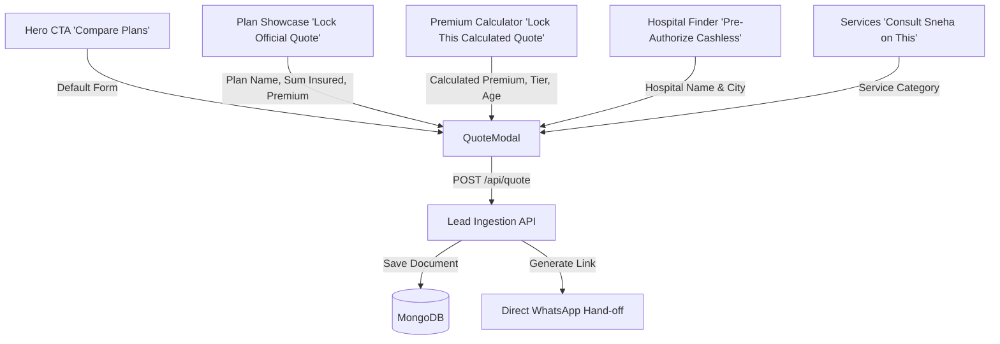

# Website Architecture & Public Application Flow

## 1. Overview
Sneha MediCare Advisory is an IRDAI-certified individual insurance advisory web application. It positions Sneha as an authorized personal insurance agent representing the "Big 3" underwriters:
- **Star Health & Allied Insurance** (Specialized Health & Senior Citizen Mediclaim)
- **Life Insurance Corporation of India (LIC)** (Sovereign Guaranteed Term Life & Endowment)
- **Tata AIG General Insurance** (Zero-Depreciation Car & Schengen/Overseas Travel Insurance)

The public application is built on **Next.js 16 (App Router)** with **React 19**, **Tailwind CSS v4**, and **Framer Motion**.

---

## 2. Page & Component Hierarchy

The entire public experience is orchestrated in `app/page.tsx`, designed as a high-conversion, dynamic single-page advisory platform.

```
app/layout.tsx (Root HTML, Google Fonts, SEO Metadata)
└── app/page.tsx (Master Client Orchestrator)
    ├── Navbar.tsx (Sticky unified announcement bar & main navigation)
    ├── HeroSection.tsx (Value proposition, credential badge, category quick-filters)
    ├── PartnerInsurers.tsx (Star Health, LIC, Tata AIG credential showcase)
    ├── ServicesSection.tsx (6 core advisory services & free policy audit banner)
    ├── PremiumCalculator.tsx (Multi-insurance calculator: Health, Car, Travel, Life)
    ├── PlanShowcase.tsx (Curated policy cards with multi-category tab filtering)
    ├── HospitalFinder.tsx (Searchable 12,000+ cashless network hospital directory)
    ├── ClaimConcierge.tsx (45-min pre-auth simulation & interactive claim tracker)
    ├── WhySneha.tsx (Bento-grid highlighting personal agent vs online aggregator)
    ├── TestimonialsAndFAQ.tsx (Real client claim stories & accordion FAQ)
    ├── Footer.tsx (Regulatory IRDAI disclosures, product links, copyright)
    └── QuoteModal.tsx (Dynamic lead capture modal with prefill pipeline)
```

---

## 3. Public Data Flow & Modal Prefill Pipeline

The application features an interconnected prefill pipeline. Actions taken in any section seamlessly prefill and launch the `QuoteModal`:



### State Management (`app/page.tsx`)
- `isQuoteModalOpen: boolean`: Controls modal open/close visibility.
- `quotePrefill: object | null`: Carries dynamic context into the form:
  - `planName`: e.g. `"Star Comprehensive Floater (Star Health)"` or `"Calculated Coverage (Family Floater, Age 32)"`.
  - `sumInsured`: Selected coverage limit (e.g. `"₹25 Lakh"`).
  - `monthlyPremium`: Pre-computed estimated premium.
  - `members`: Selected family tier or vehicle type.

---

## 4. Public File Structure

```
├── app/
│   ├── data/
│   │   └── insuranceData.ts     # Master data file for all plans, underwriters, hospitals & FAQs
│   ├── globals.css              # Global Tailwind v4 styles, custom scrollbar & color tokens
│   ├── layout.tsx               # Root layout, Google Fonts (Plus Jakarta Sans), Metadata
│   ├── page.tsx                 # Main public homepage orchestrator
│   └── api/
│       └── quote/
│           └── route.ts         # Public lead ingestion API (MongoDB + WhatsApp link generation)
├── components/
│   ├── Navbar.tsx               # Sticky header with zero-gap announcement bar
│   ├── HeroSection.tsx          # Hero banner with credential pill & live stats
│   ├── PartnerInsurers.tsx      # Star Health, LIC, Tata AIG partner strip
│   ├── ServicesSection.tsx      # Agent services grid & audit consultation CTA
│   ├── PremiumCalculator.tsx    # 4-in-1 multi-product premium & tax calculator
│   ├── PlanShowcase.tsx         # Policy comparison cards with tab filters
│   ├── HospitalFinder.tsx       # Live network hospital search by city/tier
│   ├── ClaimConcierge.tsx       # Bedside claim assistance timeline & simulator
│   ├── WhySneha.tsx             # 5-card Bento grid on agent advantages
│   ├── TestimonialsAndFAQ.tsx   # Verified client claim stories & FAQ accordion
│   ├── Footer.tsx               # Legal notices, insurer links, copyright
│   ├── QuoteModal.tsx           # Lead intake dialog with confetti & WhatsApp redirect
│   └── ui/
│       ├── badge.tsx            # Badge component (cyan, amber, outline)
│       ├── button.tsx           # Button component with size and color variants
│       └── bento-grid.tsx       # BentoGrid and BentoGridItem layout primitives
└── docs/                        # Comprehensive documentation markdown files
```
